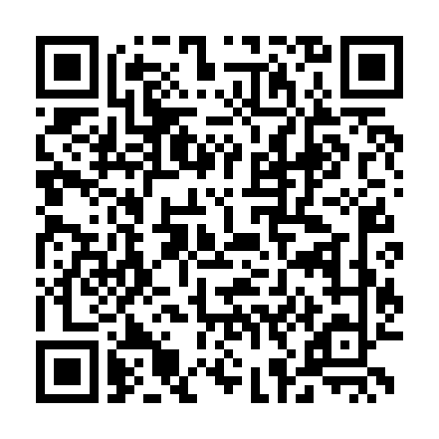

# Gynvael’s Mission 020


```
MISSION 020            goo.gl/rNHu7b               DIFFICULTY: ████░░░░░░ [4/10]
┅┅┅┅┅┅┅┅┅┅┅┅┅┅┅┅┅┅┅┅┅┅┅┅┅┅┅┅┅┅┅┅┅┅┅┅┅┅┅┅┅┅┅┅┅┅┅┅┅┅┅┅┅┅┅┅┅┅┅┅┅┅┅┅┅┅┅┅┅┅┅┅┅┅┅┅┅┅┅┅┅
Dear Agent,

Another agent working on a case stumbled on this:

  goo.gl/mJjdrM

Looks pretty simple. See where it leads.

Good luck!
--
If you find the answer, put it in the comments under this video! If you write a
blogpost / post your solution / code online, please add a link as well!
If you tweet about it, include @gynvael to let me know :)

```
[Back to live stream](https://youtu.be/PiBfI7wltM8?t=6640)

# Solution (Python)

The first link leads us to:



After decoding on the phone, we get the text:

```
Calc value, add .png, repeat: 84905785,*577,-745,-342,*954,-672,+909,+644,-556,-524,*622
```


And when we calculate it, we get the name of the next file:

http://gynvael.coldwind.pl/qrmaze/29070456023771126.png

And so on. We must write a program.

``` python

import urllib.request
from PIL import Image
from pyzbar.pyzbar import decode
import io

fname = 'start'
c = 0
while True:
    url = 'http://gynvael.coldwind.pl/qrmaze/' + fname + '.png'
    print('Downloading('+str(c)+'): '+url)
    
    filecontent = urllib.request.urlopen(url).read()
    
    qrd = decode(Image.open(io.BytesIO(filecontent)))[0].data.decode()   
    # qrd = "Calc value, add .png, repeat: 64038932,+145,*881,+493,*746"
    
    math =  qrd[qrd.find('repeat:')+8:]
    v = eval('(' * math.count(',') + math.replace(',', ')'))
    
    fname = str(v)
    c += 1

```

Starting the program... We get a last file url, before the first error.

```
Downloading(996): http://gynvael.coldwind.pl/qrmaze/2927388525763480.png
Downloading(997): http://gynvael.coldwind.pl/qrmaze/3155985463053.png
Downloading(998): http://gynvael.coldwind.pl/qrmaze/30829602240.png
Downloading(999): http://gynvael.coldwind.pl/qrmaze/1841916582137487834.png
Downloading(1000): http://gynvael.coldwind.pl/qrmaze/69129246053.png
```

The thousandth file contains a flag:

### Flag: QRCalcIsEasy


